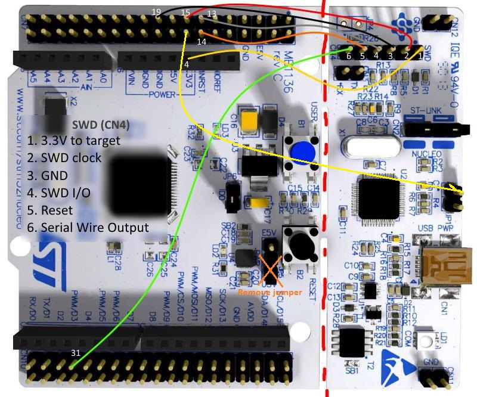
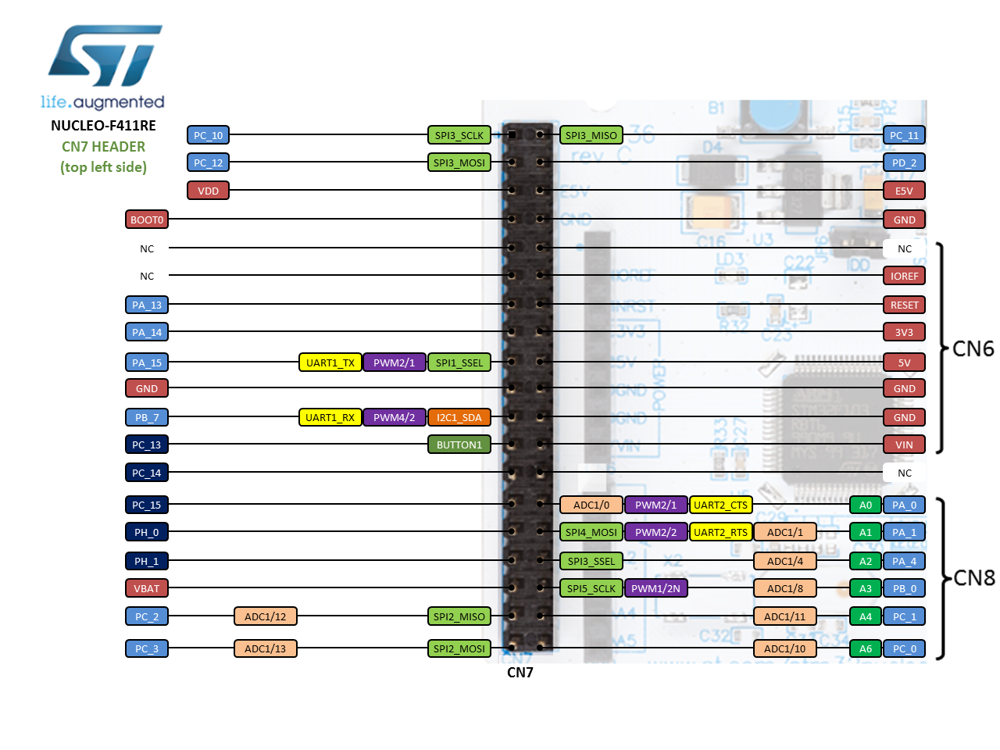
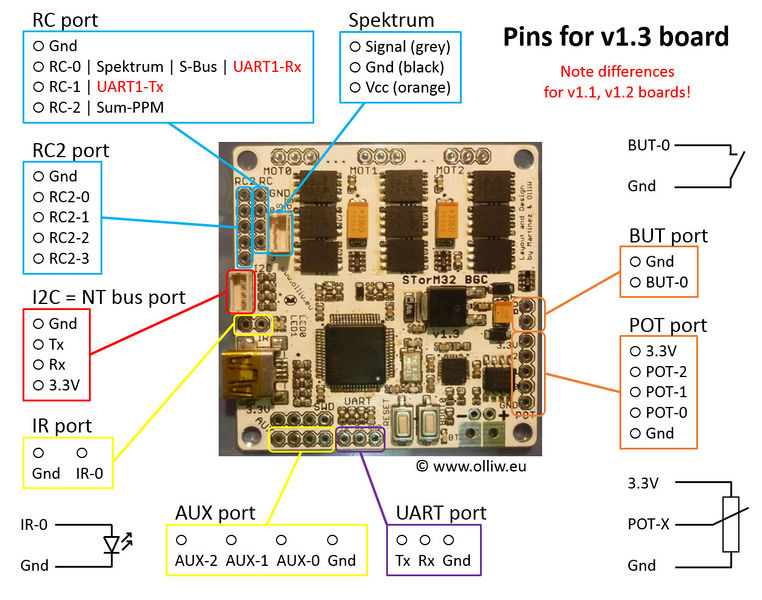

# Cinematographic Rover
Currently in development phase ...    
Tracks object pose according to the pilot specification to generate a cinematographic shot for broadcast rovers and buggies. 

## Getting Started
___
This is a detailed guide on how to set up buggy , MCU , Onboard comp and Gimbal configurations.

These instructions will get you a copy of the project up and running on your local machine for development and testing purposes. See deployment for notes on how to deploy the project on a live system.


## Prerequisites
___
The project is being built on the following hardware and software. 

### Hardware and Components
---
**MCU** - [STM32 F411RE](https://www.st.com/en/microcontrollers-microprocessors/stm32f411re.html)

**ONBOARD COMPUTER** -      
CPU - Intel Core i5-8250U @ 8x 3.4GHz   
GPU - Mesa Intel(R) UHD Graphics 620 (KBL GT2)        
KERNEL - x86_64 Linux 5.6.15-1-MANJARO

( Will be later implemented on [NVIDIA JETSON](https://www.nvidia.com/en-us/autonomous-machines/embedded-systems/jetson-nano/))

**GIMBAL** - [ALEXMOS 3 AXIS GIMBAL](https://www.aliexpress.com/item/32845757144.html?spm=a2g0s.9042311.0.0.69d04c4dwliz99)

**CAMERA** - Webcam (prototype).      
( Later to be implemented on GoPro Variant )

**BUGGY** - Simple RC Car ( Prototype )     
( Will be later implmented on [RC ROVER](https://youtu.be/9xU-PAi53EI) )

### Software Setup
---


If you decide to use PLATFORM IO do the following things else scroll down for STM32Cube Instructions. 

#### PlatformIO Installation 
---

Install PlatformIO VSCODE ( a workspace file is provided, you should see the extensions buttons and all ... if not navigate to /code/gimbal_control(ie the MCU code) there then try again )

You may get the error while uploading.
```
Error: libusb_open() failed with LIBUSB_ERROR_ACCESS
```  

try the following things 
### For Windows

Install [this software](https://zadig.akeo.ie/).     

### For linux

Quick and dirty fix.  
Run       
```
lsusb
```
Output will be ( stm debugger needs to be connected, of course)
```
Bus 001 Device 013: ID 0483:374b STMicroelectronics ST-LINK/V2.1
```
Then run this command ( Properly enter bus ID and device ID whatever pops up above) 
```
sudo chmod 666 /dev/bus/usb/001/013
```

Permanent Fix
Firmware file needs to be edited ... 
Run these commands 
```
cd /etc/udev/rules.d
sudo nano 99-openocd.rules
```
Type this content ( pleas verify idVendor and idProduct from ```lsusb``` )
Should mostly work without verification.

**For Debian Derivatives**
```
# STLink v2
SUBSYSTEM=="usb", ATTRS{idVendor}=="0483", ATTRS{idProduct}=="3748", MODE="664", GROUP="plugdev"
```

**For Arch Derivatives**
```
# STLink v2
SUBSYSTEM=="usb", ATTRS{idVendor}=="0483", ATTRS{idProduct}=="374b", GROUP="uucp"
```
If using Arch you also need to add the group ```uucp``` to your user by :

```
sudo gpasswd -a youruser uucp
```

And RESTART YOUR DEVICE IN ALL CASES.               


### STMCubeIDE Installation 
----

Please use windows the Linux versions suck , ( as of writing ), didnt find much issues during installation, u are in windows world lookup (although highly unlikely any issues) !! 

### Other Software Requirements 
---
Python Libs - 
I have written the entire code in a [Python Virtual Environment](https://realpython.com/python-virtual-environments-a-primer/)
Upto u to install In the sys or USE venv 
Either way 
Run 
``` 
pip install -r requirements.txt
```

inside code in oscar. Should get stuff up and running.

### Incase you decide to use the goPro camera, you can directly stream it

Install FFmpeg 
```
sudo snap install ffmpeg
```
For debian derivatives, for more info checkout [this](https://github.com/KonradIT/gopro-py-api/tree/master/examples/opencv_gopro) unofficial documentation. 


## Installation
---
A step by step series of examples that tell you how to get a development env running

**MCU Connections**   

      
[Refence / More Details](https://electronics.stackexchange.com/questions/167414/how-to-reconnect-nucleo-to-st-link-part)      

 

**Periferals**

        

UART Gimbal TX ( PA 12 )  ( ORANGE WIRE )           
UART Gimbal RX ( PA 11 )  ( YELLOW WIRE )           

UART OBCOMP TX ( PA 3 )   
UART OBCOMP RX ( PA 2 )   

UART STLINK/DEBUGGER TX ( PA10 )     
UART STLINK/DEBUGGER RX ( PA9  )     

LONGITUDINAL(F/B) MOTOR INPUT PWM - PC 9  ( Purple/Violet Wire )                     
LONGITUDINAL(F/B) MOTOR DIr IP 1  - PB 1  ( Blue Wire )                          
LONGITUDINAL(F/B) MOTOR DIr IP 2  - PB 15 ( Green Wire )                           

LATERAL(L/R) MOTOR INPUT PWM - PB 8                 
LATERAL(L/R) MOTOR DIr IP 1  - PB 14               
LATERAL(L/R) MOTOR DIr IP 2  - PB 13                 

& Just for reference the 


**Onboard Computer Connections**


Connecting Wifi to gopro and setting respective proirities ... 
```
sudo nano /etc/wpa_supplicant/wpa_supplicant.conf
```
And put this with your respective wifi ssid and pwd. ( note only works for raspian os, you may also wanna put this hierarchial order to choose which wifi to connect 1st )


```
network={
        ssid="MyWiFi"
        psk="MyPassword"
        key_mgmt=WPA-PSK
}
```

you can run 
```
sudo iw dev wlan0 scan | grep SSID
```
to see which SSIDs are available on Rpi network. 

and run 

```
 iw wlan0 link
```

to see which wifi youre connected to.


**Serial Comms :**    
Simple USB to TTL Adapter ( as of now ).

Set the appropriate port in [comArduino2.py](code/jetson/ComArduino2.py) at the end of file.

Windows 
---

Open device manager, see com port. 

Linux 
---
```
ls /dev/tty*
```

the port index you get tttyUSBX  

**Gimbal Installation**


* RC2-1 : pitch 
* RC2-2 : roll 
* RC2-3 : yaw 

Connect UART accordingly to the STM.

Gimbal inversion using [Olliw's GUI ](http://www.olliw.eu/2013/storm32bgc/) ( Ver 0.96).      
[MAVLINK setup and usage](http://www.olliw.eu/storm32bgc-wiki/MAVLink_Communication).

**Camera Installation** 


See 
Type 
```
ls /dev/video*
```

You will get /dev/videox
try removing webcam 
run command         
plug cam    
run command    

Get the ```x``` val 

Nav to code/tests/camtesting.py

Set camera source index as ```x```
And run . Your cam should fire and you should be able to see the output feed. 

```
python3 camtesting.py
```

The new index will be the index of Webcam to be added cam Source to [main.py](code/jetson/main.py).     

**Buggy installation**

Nil as of now.

**Onboard Computer and GUI installation**

Nav to /code/pilotdash 

```
python3 plottingFromFile.py
```

This gives me raw and filtered(if any) trajectory of the last motion.

```
python3 splinePlot.py
```
This gives me interpolated curves for the coeffs in [splineCoeffs.txt](code/pilotdash/splineCoeffs.txt)

## Running the tests

Explain how to run the automated tests for this system

### Break down into end to end tests

Explain what these tests test and why

### Testing vision algos Obcomp
___
In the main.py file in /vision
Make the following changes and run the program.
```
INCLUDE_STM = False
```     
Doing this will run the default vision algo code on your default webcam. If fails to open Camera put 1,2,3 ... 
```
VID_SRC = 0
```
### Testing Gimbal
---
Simply power it on it should be inverted and work something like this ( wait a few 15-30 secs for it to self calibrate. )

### Testing MCU 
---
Make sure all periferals are Connected.      
LEDS will blink thrice 2 times.     
The first set indicates it has Started setup and second state is being used for debugging purpose.

### Testing Comms betn Obcomp and MCU 
---
Nav to vision     
Run ComArduino2.py (setup appropriate ports).        

Check if opencv is installed correctly 

run 
```
python -c "import cv2; print(cv2.getBuildInformation())" | grep -i ffmpeg
```
it should return    
```
FFMPEG:                      YES
```

### And coding style tests

Explain what these tests test and why

```
Give an example
```

## Deployment

Add additional notes about how to deploy this on a live system

### Testing OBCOMP and MCU
---
Make sure you do this and appropriately setup UART port of obcomp in ComArduino2.py
```
INCLUDE_STM = True
```
Run the main.py python file.
After the setup ends of the MCU it will send an ACK command to the OBCOMP. 
Till then it will wait for MCU setup to complete.

### Testing Gimbal and MCU 
---
Once individual testing is done.    
Gimbal should move or nod itself in all dirs.
Hit reset again just to be sure. 

### Testing Buggy and MCU 
---
yet to be implemented.


## Built With

* [Dropwizard](http://www.dropwizard.io/1.0.2/docs/) - The web framework used
* [Maven](https://maven.apache.org/) - Dependency Management
* [ROME](https://rometools.github.io/rome/) - Used to generate RSS Feeds

## Contributing

Please read [CONTRIBUTING.md](https://gist.github.com/PurpleBooth/b24679402957c63ec426) for details on our code of conduct, and the process for submitting pull requests to us.

## Versioning

We use [SemVer](http://semver.org/) for versioning. For the versions available, see the [tags on this repository](https://github.com/your/project/tags). 

## Authors

See also the list of [contributors](https://github.com/your/project/contributors) who participated in this project.

## License

This project is licensed under the MIT License - see the [LICENSE.md](LICENSE.md) file for details

## Acknowledgments

* Hat tip to anyone whose code was used
* For this readme Template [PurpleBooth](https://github.com/PurpleBooth)
* Inspiration
* etc

